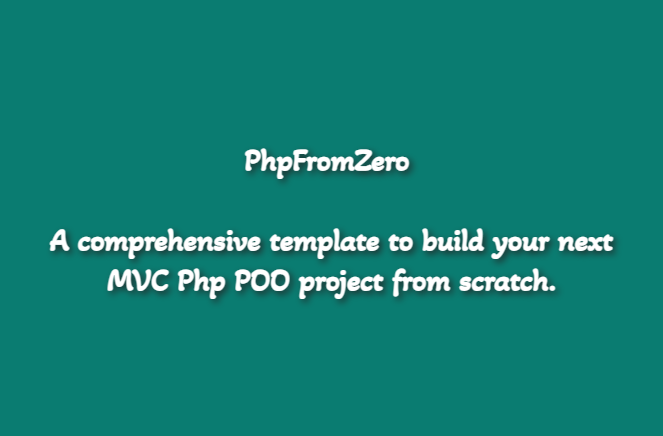

# PhpFromZero



<p align="center">
  <b>A comprehensive project template for beginners to learn PHP web development from scratch.</b>
</p>

<p align="center">
  <a href="https://github.com/Dahkenangnon/PhpFromZero" style="text-decoration: none;">
    
  </a>
  <a href="https://github.com/Dahkenangnon/PhpFromZero/blob/master/LICENSE" style="text-decoration: none;">
    
  </a>
</p>

---

## Objective

PhpFromZero is a handcrafted project template aimed at helping beginners in PHP web development. It provides a solid foundation for learning how to create powerful websites from scratch using an object-oriented approach and the Model-View-Controller (MVC) design pattern, without relying on external dependencies.

This project template is well-documented and designed to be easily understandable for junior PHP developers. By using PhpFromZero, you will:

- Gain hands-on experience in creating PHP websites with an object-oriented approach.
- Develop a clear understanding of how web applications work.
- Acquire the skills needed to learn and work with various PHP frameworks.
- Possess the knowledge to build your own PHP framework with ease.

---

## Features

- **Object-Oriented PHP**: Learn how to structure your code using object-oriented programming (OOP) principles for improved maintainability and code organization.
- **MVC Design Pattern**: Understand and implement the Model-View-Controller (MVC) design pattern to separate concerns and achieve better code structure.
- **Documentation**: Detailed documentation guides you through the project structure, code explanations, and usage instructions.
- **Educational Purpose**: PhpFromZero is designed to facilitate learning and provide a solid foundation for beginners in PHP web development.

---

## Requirements

To run PhpFromZero, make sure you have the following:

- Wamp or Xampp installed and configured.
- MySQL database.
- PHP 8 or newer.

---

## Attention

- PhpFromZero requires PHP 8 or newer to run.
- This project is used for educational purposes, such as training new developers at [Paonit.com](https://paonit.com/).
- Use this template at your own risk.
- If you want to use this template in a real project, it is highly recommended to improve security and performance aspects.
- For any questions or discussions, feel free to contact dah.kenangnon@gmail.com or join the discussion on the [GitHub repository](https://github.com/Dahkenangnon/PhpFromZero/discussions).

---

## Try it on Your Computer

To run PhpFromZero on your computer, follow these steps:

1. Clone the repository: `git clone https://github.com/Dahkenangnon/PhpFromZero.git`
2. Create a new database as mentioned in `env.local.php`.
3. Import the `php_from_zero.sql` file into the newly created database.
4. Run the following command in the project directory:
```bash
php -S localhost:9000 -t public
```
5. Open your browser and navigate to [http://localhost:9000](http://localhost:9000) to view the pages.
   - Please note that depending on your environment's configuration, you may encounter some errors.

---

## Extending

PhpFromZero is designed to help junior developers understand the inner workings of web applications and create their own PHP projects

 with well-structured and maintainable architecture. It provides a simplified approach for educational purposes and may not be suitable for production environments.

---

## Author

- Justin Dah-kenangnon
- Email: dah.kenangnon@gmail.com

---

Thank you for choosing PhpFromZero! Give it a star on [GitHub](https://github.com/Dahkenangnon/PhpFromZero) if you find it helpful. We encourage you to give it a try, explore the features, and contribute to its improvement. Happy coding!
